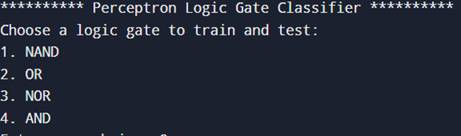
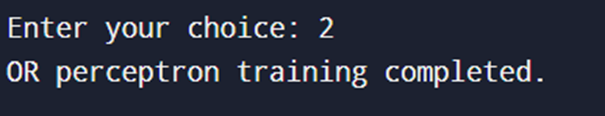
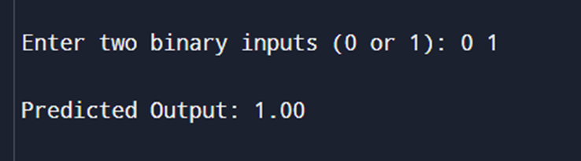

# Perceptron_in_C
- This project demonstrates how perceptrons learn binary classification problems and trains models to approximate logic gate functions
- The structured learning process, combined with gradient-based optimization, helped reinforce key programming and AI concepts. 
- Through practical implementation, we gained hands-on experience in neural network training, showcasing the power and limitations of single-layer perceptrons in classification problems.

# Demonstration of the project

- The program starts by welcoming the user and displaying a menu-driven interface for logic gate selection.
- The user is presented with options to train or test a perceptron model for different logic gates (NAND, OR, NOR, AND).
- The user selects option 1 to begin training the NAND gate perceptron, initiating the weight initialization process.

- The perceptron begins training by iterating over the dataset.
- It displays initial weights, computed errors, and updated weights over multiple 1000s epochs.
- This process refines the perceptron's ability to classify logic gates correctly.

- The user enters test values (e.g., `1 1` for NAND).
- The perceptron applies the learned weights and bias, computes the activation function, and outputs a prediction close to 0 or 1 based on the training results.
- The system confirms whether the classification matches the expected logic gate output.
